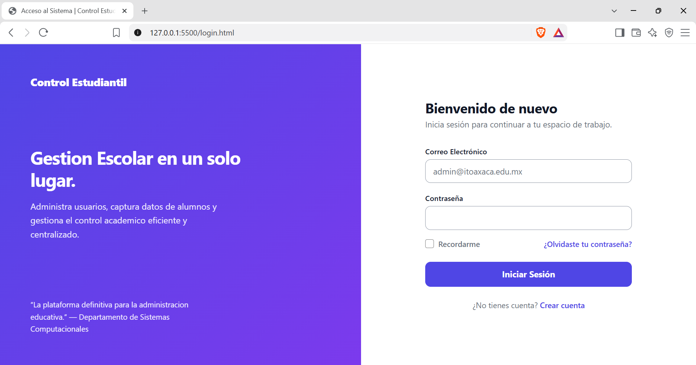
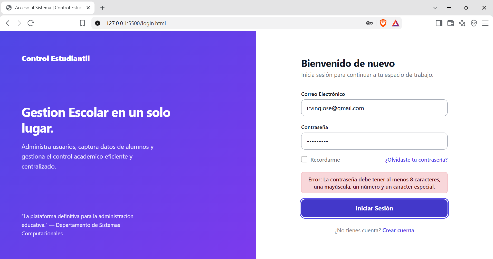
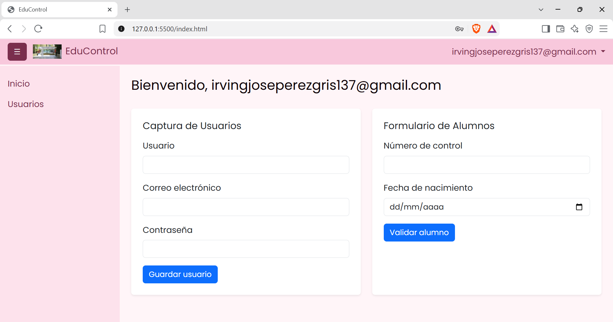
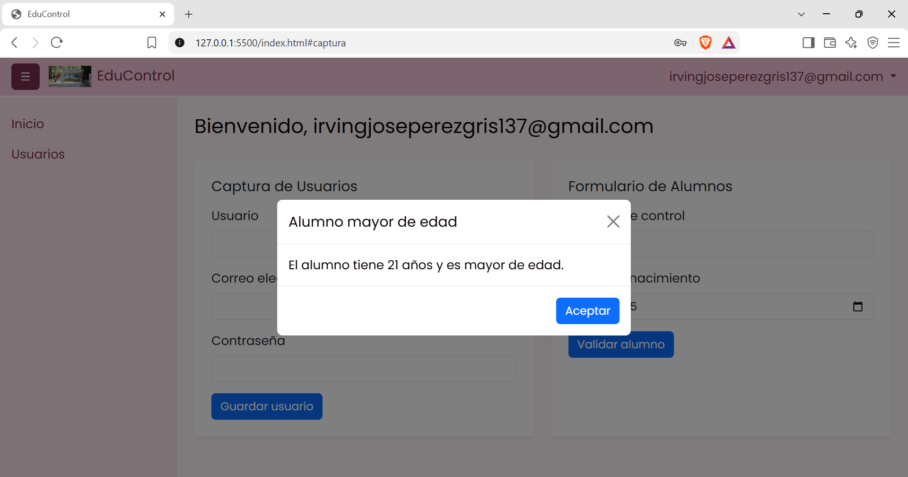

# EduControl - Sistema de Gestión Escolar (Login y Dashboard)

## 1. Portada
* **Proyecto:** Sistema de Control Estudiantil.
* **Integrantes del Equipo:**
  1. **Irving José Pérez Gris:** Login y validaciones.
  2. **Fernández López Jazmín:** Sidebar, Navbar y sesión.
  3. **Sandoval Reyes Miguel:** Formularios internos y modal.
* **Descripción breve:** Aplicación web interactiva que simula el flujo completo de un sistema de administración escolar. Incluye una pantalla de acceso validada y un panel de control interactivo, gestionando la sesión temporal del usuario.

## 2. Explicación Técnica y Documentación

* **Framework CSS utilizado:** **Bootstrap 5.3**. Elegido por su sistema de cuadrícula (Grid) y sus componentes nativos interactivos (Navbar, Collapse, Modales).
* **Flujo del Login y Sistema de Sesión:**
* El usuario ingresa en `login.html`.
* Las credenciales se validan localmente utilizando métodos de la librería `utileria.js`.
* **Traspaso de datos:** Al pasar las validaciones, el sistema simula un login exitoso guardando el correo del usuario en la memoria del navegador usando `localStorage.setItem('usuarioLogueado', correo)`. Luego redirige al usuario a `index.html`.

* **Métodos principales implementados:** `validarCorreo()`, `validarPassword()` y `calcularEdad()`.

## 3. Proceso de Creación (Paso a Paso)

### Fase 1: Login y Validaciones (Por Irving J. Pérez)
1. **Configuración del Repositorio:** Creación de la estructura de carpetas (`css`, `js`, `img`) e inicialización del repositorio en GitHub.
2. **Interfaz de Acceso:** Diseño e implementación de un patrón "Split-Screen" moderno en `login.html`, adaptando los colores corporativos y los textos al contexto *(Interfaz basada en la plantilla libre [Split-Screen Login Form de UICookies](https://uicookies.com/snippets/split-screen-login-form/))*.
3. **Lógica de Autenticación:** Se programó el archivo `login.js` para interceptar el formulario, ejecutar las validaciones estrictas y gestionar el `localStorage`.

### Fase 2: Navbar y sidebar (Fernández López Jazmín)

1. Se creó `index.html` y se agregó Bootstrap con CDN.
2. Se hizo navbar con el botón ☰, el nombre del sistema, el usuario y el botón **Salir**.
3. Se hizo el menú de la izquierda (sidebar), que se abre y se cierra con el botón ☰.
4. Dentro del menú se puso **Usuarios > Captura**, que se despliega al darle clic.

### Fase 3: Formularios Internos y Modal (Por Sandoval Reyes Miguel)
1. **Captura de Usuarios:** Se agregó dentro de `index.html` un formulario con los campos Usuario, Correo electrónico y Contraseña.
2. **Validación de Usuarios:** En `js/index.js` se utiliza `validarCorreo()` para comprobar el correo y `validarPassword()` para verificar la contraseña antes de aceptar la captura.
3. **Formulario de Alumnos:** Se agregó un formulario con Número de control y Fecha de nacimiento.
4. **Número de Control:** Se valida que el dato tenga exactamente 6 dígitos antes de continuar.
5. **Cálculo de Edad:** Se utiliza `calcularEdad()` de la librería `utileria.js` para obtener la edad del alumno.
6. **Modal de Bootstrap:** Después de validar al alumno se abre un modal que muestra la edad e indica si es mayor o menor de edad.

## 4. Capturas de Pantalla

Para completar la documentación se deben agregar capturas del flujo funcionando:

- Pantalla de Login.
- Dashboard después de iniciar sesión.
- Formulario de Captura de Usuarios.
- Validación correcta e incorrecta de correo y contraseña.
- Formulario de Alumnos.
- Modal mostrando un alumno mayor de edad.
- Modal mostrando un alumno menor de edad.
- Menú del usuario y opción Salir.

## 4. Capturas de Pantalla del Flujo Completo

**1. Pantalla de Login:**

**2. Validación incorrecta de contraseña:**

**3. Dashboard después de iniciar sesión (Menú de usuario y Salir):**

**4. Formularios de Usuarios y Alumnos:**

**5. Modal de Alumno Mayor/Menor de edad:**

## 5. GitHub Pages

Al finalizar la integración de las tres partes, el repositorio debe publicarse con GitHub Pages y comprobar el flujo completo:

`login.html → index.html → formularios → salir → login.html`

**Repositorio del código:** https://github.com/IrvingJosePG/sistema-login-js.git
* **Proyecto en línea (GitHub Pages):** https://irvingjosepg.github.io/sistema-login-js/
